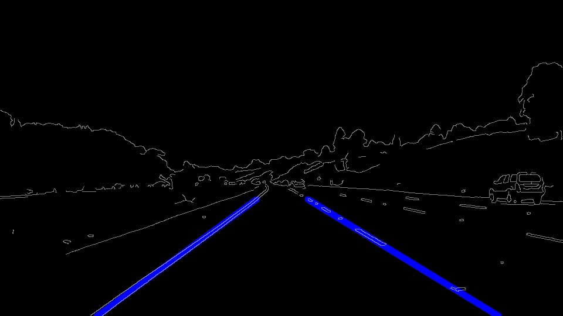

# **Finding Lane Lines on the Road** 

## Writeup for CarND- Term1

### This is the project description for finding lane lines on the road.

---

### Project Description

### 1. Describe your pipeline. As part of the description, explain how you modified the draw_lines() function.

My pipeline consisted of 5 steps. First, I converted the images to grayscale, then I applied gaussian blur on the grayscale image and found the edges using the Canny Edge detection. Then I selected a triangular region of interest and masked the image with black pixels in the rest of the area. Next, I used Hough transform on the edges to detect lines on the edges. Then I drew those lines on top of the original 3 channel color image.

In order to draw a single line on the left and right lanes, I modified the draw_lines() function by using the lines detected by Hough lines, to identify two dominant polynomials that represented left and right lanes on the road using slope. I am using slope defined a specific range to ignore horizontal and vertical lines. I did a first order polyfit using all points in hough lines after binning them by slope. Then I back-calculated x coordinates using the polynomials for these coordinates at limits of my area of interest. 

If you'd like to include images to show how the pipeline works, here is how to include an image: 

### 2. Identify potential shortcomings with your current pipeline

* One potential shortcoming is that the algorithm currently works on straight lines so it would not work on curved roads
* The algorithm is very sensitive to the region of interest and considers all the lines in the region specified as lanes

### 3. Suggest possible improvements to your pipeline

* Instead of assuming a line for the lane, we could use a higher order polynomial to fit the lane so that it incorporates curved lines.
* The algorithm should consider the lanes closest to the vertical line going through the center of the image so that it does not consider far off lanes
* Many values in the code are hard coded and should be variables dependent on the image size.

